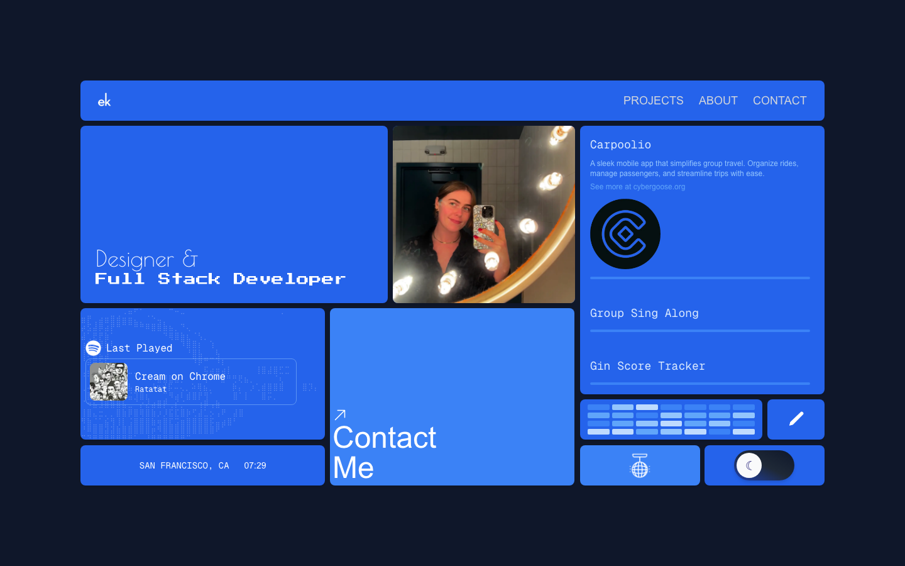
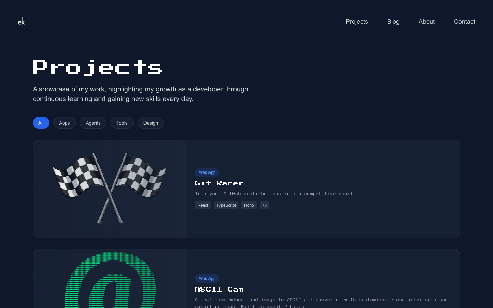
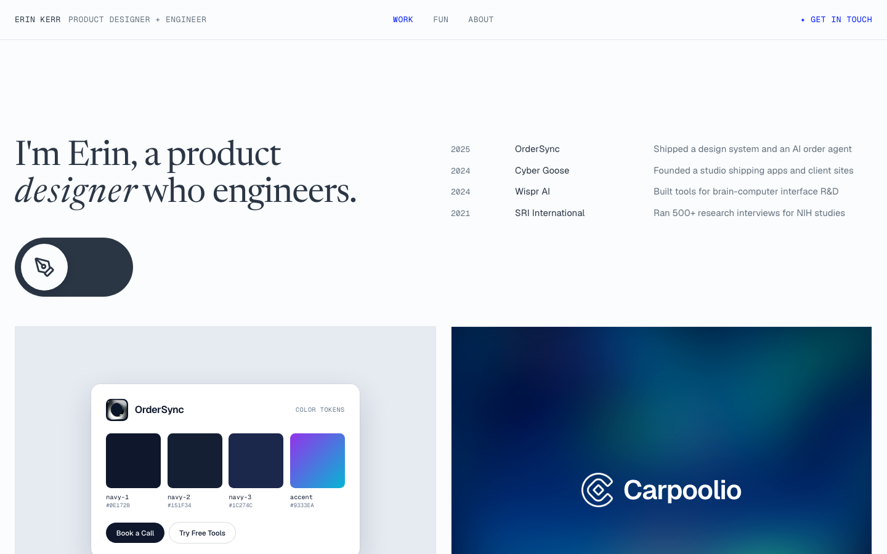
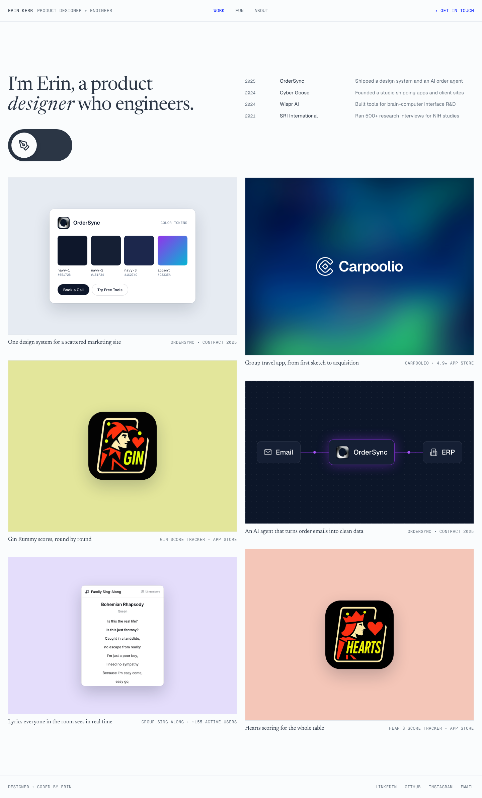

# Portfolio Redesign

> DRAFT for the `/portfolioRedesign` page. Sections: Overview, Problem, Goal, Process, Research, Exploration, Prototyping & testing, Design decisions, Results, Reflection. Anything in [brackets] is for Erin to fill in or confirm. **TO MAKE** marks a figure that doesn't exist yet. Screenshots are in `docs/redesign-2026/`.

---

## Overview

A designer told me my portfolio read like an engineer's, which is a problem when you're applying for UI/UX roles. I built it when I was first starting out in software engineering, and as my work moved toward design, the site never did.

So I audited it, studied 265 designer job posts and 10 portfolios of new design hires, and redesigned it from a blank page to lead with design.

A portfolio is a product that's never finished, which makes it the perfect medium for user feedback loops. Each round of testing shapes the next version, so it keeps getting better.

| | |
|---|---|
| **Timeline** | September to October 2026 |
| **Tools** | [Figma, FigJam], Next.js, Tailwind CSS |
| **Scope** | Website redesign |

---

## Problem

My portfolio was pitching me for a different job. When I walked through the site the way a design hiring manager would, the evidence was everywhere.

*The 2025 first screen. "Designer &" is a thin script and "Full Stack Developer" is a heavy pixel typeface, so the type picks a side before anyone reads a word.*

### 1 of 10
**tiles on the first screen was about my work.** The rest were a photo, my last-played Spotify track, a clock, a GitHub contribution graph, a blog link, a disco-ball mode, a dark-mode toggle and a contact link.

- **The copy was about code.** Across the homepage and About page, I mentioned development, coding or software 13 times and design twice. About opened with "My path into software development wasn't traditional."
- **The projects page was sorted for engineers.** It promised "my growth as a developer," opened with Git Racer and a two-hour ASCII camera, and put my only design case study fourth of 13. Every card listed a tech stack.
- **The visual language was a developer's.** Pixel display type, monospace body text, and one saturated blue on every tile. Every tile had equal weight, so nothing stood out as the most important.
- **The details people check first were wrong.** The location said San Francisco, but I live in New York. The link preview, which is what people see when I paste my portfolio into an application, said "Software Engineer & Developer Content Creator."

*The 2025 projects page. My one design case study was fourth of 13.*

**[TO MAKE: the link-preview card from pasting erinkerr.me into LinkedIn or Slack. Capture it before the title is fixed.]**

---

## Goal

1. **Lead with design** without hiding the engineering.
2. **Put real, shipped work on the first screen.**
3. **Make every line true.** Each one should trace back to my resume or to work someone can see.

**How I'll know it worked:** reviewers reach a design case study within their first two minutes, and they name a design project when asked what they remember.

---

## Process

**[TO MAKE: a simple timeline graphic of these five stages.]**

1. **Audit.** I walked the 2025 site as a hiring manager would and catalogued what it said.
2. **Research.** I studied what design teams ask portfolios to prove, looked at the portfolios of people hired into the roles I want, and talked to reviewers.
3. **Explore.** I tried a first direction, threw it out, and started from a blank page.
4. **Prototype and test.** I built in code, which is my fastest medium, and put each version in front of reviewers.
5. **Ship and measure.**

[Optional honesty line: "In practice these overlapped. I started building before the research was done, and the research changed [what]."]

---

## Research

### What design teams ask a portfolio to prove

I pulled 265 live designer job posts (product, UI/UX, brand and design manager roles) from 98 companies, and 182 of them explicitly mention a portfolio. I gathered the "show us evidence of…" requirement lines too, so the map captures what a portfolio needs to prove, not just the "send a link" mentions. I wrote 204 verbatim quotes on sticky notes and sorted them until 19 clusters and 5 themes emerged.

**[The interactive affinity map goes here. It's already built: `<AffinityMap />` on this page.]**

What the map showed. The first number is the share of portfolio mentions that ask for each thing. The second is the share of all posts that mention it anywhere.

| What they ask for | Portfolio asks | Whole post |
|---|---|---|
| Taste & quality bar ("curate hard") | 34% | 91% |
| Shipped work | 25% | 83% |
| Relevant surfaces | 21% | 77% |
| Visual craft | 21% | 72% |
| Systems thinking | 17% | 92% |
| Prototyping & code | **2%** | **88%** |

**Insights**

1. **A portfolio is judged on craft and taste.** Curation was the single biggest portfolio ask. A few pieces with a clear point of view beat a long list of okay work, and my old site was a long list.
2. **Code is valued in the job, but it isn't what the portfolio is judged on.** 88% of posts mention prototyping or code somewhere, but only 2% of portfolio asks do. My engineering is a real advantage, but it should support the design work, not lead.
3. **Shipped work outranks concepts.** Live, used work came second. I have shipped apps with real ratings and users, and my old site hid that behind tech-stack chips.
4. **Posts expect a clear story.** 92% of posts mention reasoning, rationale or storytelling. Case studies should run problem, exploration, decision, result, which is why this one is structured the way it is.

### Other portfolios

**[TO MAKE: a landscape grid of about 12 portfolios: 5 junior product designers at companies I'm applying to, 3 design engineers, and 4 I admire.]** [2 or 3 patterns, with counts.]

### Talking to people

[Who gave the original feedback, and what they said when I followed up.]

[n] sessions with [who]. Each person reviewed the old site as if hiring a junior product designer with two minutes before their next meeting, thinking out loud. [What they remembered, where they stopped, whether they found a design case study. Best quotes.]

---

## Exploration

**First direction: a design page bolted onto the old site.** I added a separate `/design` landing page in electric blue, with four case-study cards, a "how I work" section and my tools. [Why it didn't work. Suggested: reviewers land on the homepage, not `/design`, so the front door still said developer.] I threw it out.

**Starting over, and keeping the old site.** I froze the 2025 site at `/archive/2025`, unchanged, with its own copies of every component so future redesigns can't break it. The idea came from Lynn Fisher's archive, where every edition of her site stays online. It lets me start from a blank page without deleting work I'm proud of, and anyone can compare the two versions.

**References.**

- **rachelchen.tech:** a mono header, serif headlines, and tiles that are one brand color with one real object on them.
- [Others from the landscape grid.]

**[TO MAKE: a grid of 3 to 5 lo-fi homepage directions, including the rejected `/design` page, with a line on each.]**

**[TO MAKE: sitemap before and after.]** The 2025 site put 13 projects, a blog and widgets on one level. The 2026 site splits into Work (six case studies), Fun (seven side projects), About, and the Archive.

---

## Prototyping & testing

I prototyped in code instead of static mockups. That's how I work fastest, and it meant reviewers were testing the real thing: real type rendering, the real switch, and the real mobile layout.

The prototype went through these versions:

1. A blank homepage linking to the archive.
2. Work, Fun and About pages.
3. The designer/engineer switch.
4. [Later iterations.]

**Testing.** [n] reviewers saw the old site and then the prototype, with the same scenario and the same questions.

**[TO MAKE: a screenshot of the session script.]**

| What testing showed | What I changed |
|---|---|
| [finding] | [change] |
| [finding] | [change] |

---

## Design decisions

**1. A headline where design is the noun.** "I'm Erin, a product *designer* who engineers." The research showed code is valued but not what a portfolio is judged on, so design is the identity and engineering is how I work.

**2. A switch for the engineers.** A pen nib and `</>` toggle moves the italics from "designer" to "engineers" without shifting the surrounding words. It saves the side in the URL (`?side=engineer`), so one site serves both audiences.

**3. Curating hard.** Six case studies on Work. Seven side projects moved to a Fun page, "Side quests, small tools, & one app Apple rejected." The widgets are gone. The research backs this up: curation was the top portfolio ask.

**4. Titles that say what it does, labels that show proof.**

| Before | After |
|---|---|
| Gin Score Tracker | Gin Rummy scores, round by round · App Store |
| Group Sing Along | Lyrics everyone in the room sees in real time · ~155 active users |
| Carpoolio | Group travel app, from first sketch to acquisition · 4.9★ App Store |

Shipped work outranks concepts, so the labels lead with ratings and users instead of tech stacks.

**5. Thumbnails built from the real thing.** Each tile is one brand color with one object on it, and that object is real UI rebuilt in code: OrderSync's actual color tokens and buttons, a live lyrics card, and the order agent's flow (Email → OrderSync → ERP).

**6. An experience list that says what I did,** not my title. For example: "Ran 500+ research interviews for NIH studies."

**7. An About page rewritten around design.** "My path into software development wasn't traditional" became "My path into design wasn't traditional," and it now connects my research interviews to how I design.

**8. Every line true.** I checked every claim on my OrderSync case study against the project and cut three:

- **Analytics work:** I had credited analytics work that wasn't mine.
- **"Zero design debt":** My own audit tool disproved this. It found 22 off-palette colors.
- **Overstated wording:** some phrasing claimed more than the work showed.

### Design system

| Token | Light | Dark | Contrast (light / dark) |
|---|---|---|---|
| paper | `#FAFCFD` | `#2B3645` | |
| ink | `#2B3645` | `#FAFCFD` | 11.9 / 11.9 |
| muted | `#66727F` | `#A7B1BD` | 4.8 / 5.6 |
| line | `#E3E8EE` | `#3D4A5C` | |
| blue | `#001AFF` | `#A5B1FF` | 7.9 / 6.0 |

**Type and components.**

- **Newsreader** for headlines.
- **Geist** for body text.
- **Geist Mono** for labels. This keeps a small dose of the old site's engineering flavor.
- **Components:** SiteShell, SiteHeader, Tile and HeroHeadline.

**Accessibility.** Every text color passes WCAG AA.

- The switch uses `role="switch"`.
- Every interactive element has a visible focus ring.
- Motion respects reduced-motion settings.
- Every tile has descriptive alt text.

**[TO MAKE: a one-page design system sheet.]**

---

## Results

| | 2025 | 2026 |
|---|---|---|
| Headline | "Designer & **Full Stack Developer**" | "I'm Erin, a product *designer* who engineers." |
| First screen | 10 tiles, 1 about work | Headline, experience, then case studies |
| Lead project | Git Racer | OrderSync design system |
| Card labels | Tech stack | App Store rating, active users, client |
| Side projects | Mixed in with client work | Their own page |
| Old site | Overwritten | Archived at `/archive/2025` |

**[TO MAKE: session results, old versus new.]** [For example: "On the old site, n of 5 reviewers reached a design case study within two minutes. On the new one, n of 5 did." Real numbers only.]

[After launch: replies from design roles, which case studies get opened.]

> "[Best reviewer quote about the new site.]"

---

## Reflection

[2 or 3 short paragraphs in your words. Prompts:]

- [What surprised you most in the audit, or in the job-post research?]
- [What was hardest to cut?]
- [What would you do differently? For example: "I started building before I'd done the research. Next time I'd study the job posts first, because the curation finding would have saved me the first direction."]
- [What's next for the site?]
