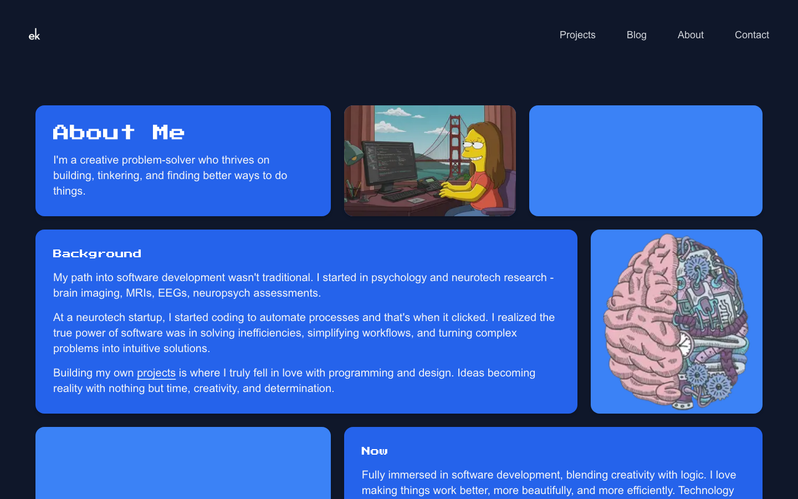
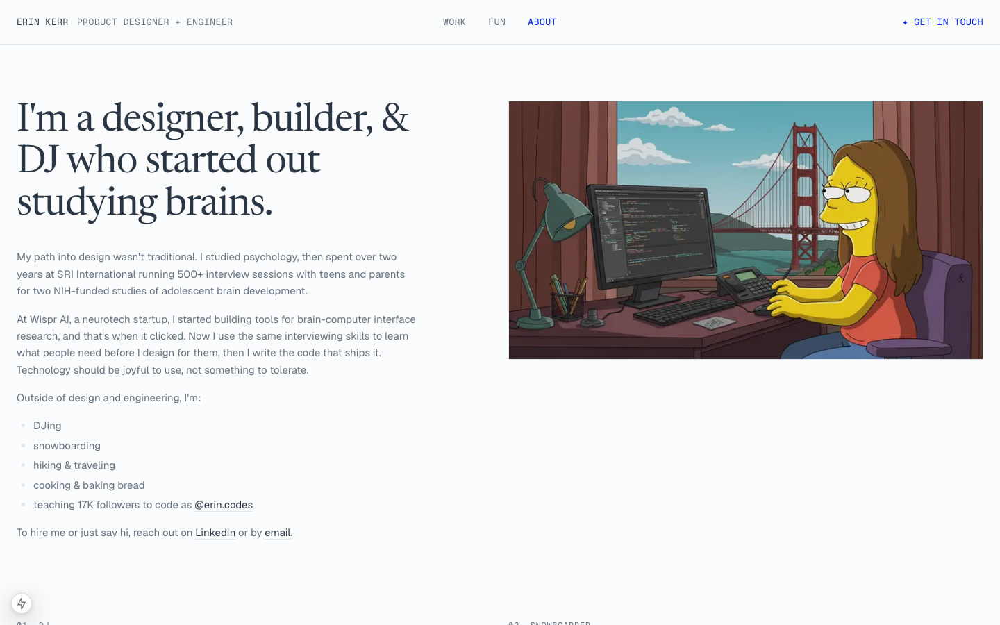

# Rebuilding my portfolio for design roles

> DRAFT, structured after the Tumblr reblogs case study (heckhouse.com/work/refining-reblogs-at-tumblr). Figures marked **TO MAKE** come out of the research steps. Anything in [brackets] is for Erin to fill in. Existing screenshots are in `docs/redesign-2026/`.

**Summary.** I built my 2025 portfolio while I was applying for engineering jobs. When I started applying for product design roles, [who] told me it [their words, e.g. "reads like an engineer's portfolio"]. This case study covers how I audited the old site, studied the portfolios of people hired into the roles I want, tested both versions with [n] reviewers, and rebuilt the site so it leads with design.

**Context.** I came to design through psychology research, where I ran 500+ interview sessions for NIH studies at SRI International, and through building and shipping my own apps. That left me with a portfolio full of things I'd built and very little showing how I design.

**Role.** Designer, researcher and developer, solo · September to October 2026 · [Figma], Next.js, Tailwind CSS

---

## Why this mattered

A resume can say "product designer." The portfolio is where a hiring manager decides whether to believe it. [After the landscape research: 1 or 2 sentences on what the portfolios of people hired into these roles have in common, with counts.]

**[FIG 1, TO MAKE (plan step 3): the landscape grid.]**
*Fig 1. I studied 12 portfolios: five from junior product designers at companies I'm applying to, three from design engineers, and four I admire. [Pattern, e.g. "9 of 12 put a case study on the first screen."]*

## Walking the old site as a hiring manager

This is the path a design hiring manager would take through my 2025 site.

*Fig 2. The first screen. "Designer &" is set in a thin script and "Full Stack Developer" in a heavy pixel typeface, so the type picks a side before anyone reads a word. Around it: my last-played Spotify track, a clock, a GitHub contribution graph and a disco-ball mode.*

*Fig 3. The projects page promises "my growth as a developer." It opens with Git Racer and an ASCII camera I built in two hours. My one design case study is fourth of 13, and every card lists a tech stack.*

*Fig 4. The About page opens with "My path into software development wasn't traditional" and lists my hobbies under "When I'm not coding I:".*

**[FIG 5, TO MAKE: screenshot of the preview card that appears when you paste erinkerr.me into LinkedIn or Slack.]**
*Fig 5. Before anyone even visits, the link preview introduces me as "Software Engineer & Developer Content Creator."*

## The problem: the work was buried

### 1 of 10
**tiles on my first screen was about my work.**

The site wasn't bad. It was making the case for a different job. Across the homepage and About page, I mentioned development, coding or software 13 times and design twice. The location tile still said San Francisco, a year after I'd moved to New York. [Check the timing.]

## Confirmed by feedback

> "[The feedback quote.]"
> [who, their role]

[2 or 3 things reviewers said or did on the old site during the sessions. For example: what they remembered after two minutes, where they stopped scrolling, whether they ever reached a design case study.]

## Goals

1. **Lead with design** without hiding the engineering.
2. **Put real work on the first screen.**
3. **Make every line true.** Each one should trace back to my resume or to work someone can see.

My hypothesis: if the first screen led with design work, reviewers would reach a design case study within their first two minutes, and they'd name a design project when asked what they remembered.

## Exploring directions

My first attempt kept the old site and added a separate design landing page in electric blue. [Why it didn't work. Suggested: reviewers land on the homepage, not on /design, so the front door still said developer.] I threw it out, froze the old site as an archive, and started from a blank page.

**[FIG 6, TO MAKE (plan step 7): a grid of 3 to 5 lo-fi homepage directions, including the rejected /design page.]**
*Fig 6. [One line per direction: what it tried, and why I picked it or didn't.]*

**[FIG 7, TO MAKE: sitemap before and after.]**
*Fig 7. The 2025 site put 13 projects, a blog and a set of widgets all on one level. The 2026 site splits into Work (six case studies), Fun (seven side projects), About, and an Archive of past editions.*

I borrowed from two places:

- **Lynn Fisher's archive:** keeping every past edition of the site online.
- **rachelchen.tech:** serif headlines, a mono header, and tiles that are one brand color with one real object on them.

[Add others from the landscape grid.]

## Research and testing

I ran [n] sessions of 20 to 30 minutes each, with [n] product designers, [n] recruiters or hiring managers, and [n] design engineers. Each reviewer looked at the old site and then the new one. The setup was that they were hiring a junior product designer and had two minutes before their next meeting. They thought out loud as they went.

**[FIG 8, TO MAKE: a screenshot of the session script, the way the Tumblr study shows theirs.]**

What came out of it:

- [Behavior or sentiment 1, with a quote]
- [Behavior or sentiment 2]
- [Something that surprised me, and what I changed because of it]

## Shipped design

*Fig 9. The new first screen. The headline makes design the noun and engineering the verb: "I'm Erin, a product designer who engineers." The experience list says what I did at each place instead of my job title.*

**[FIG 10, TO MAKE: a short screen recording, or two stills, of the switch.]**
*Fig 10. A switch with a pen nib on one side and </> on the other moves the italics from "designer" to "engineers" without shifting the surrounding words. It saves the side in the URL, so I can send a design-engineering team a link that opens on their side.*

*Fig 11. The Work tiles. Each title says what the project does for people ("Gin Rummy scores, round by round"), and the label underneath shows proof (4.9★ App Store, ~155 active users, Contract 2025) instead of a tech stack. The thumbnails are real UI rebuilt in code: OrderSync's actual color tokens and buttons, and a live lyrics card.*

*Fig 12. Side projects moved to their own page, "Side quests, small tools, & one app Apple rejected." The personality stays, but it no longer competes with the work.*

*Fig 13. About now opens with "My path into design wasn't traditional" and connects my 500+ research interviews to how I design.*

**[FIG 14, TO MAKE (plan step 8): a one-page design system sheet.]**
*Fig 14. Five color tokens with light and dark values. Every text color passes WCAG AA (in light mode: ink 11.9:1, muted 4.8:1, blue 7.9:1). Newsreader for headlines, Geist for body text, Geist Mono for labels. Four components: SiteShell, SiteHeader, Tile and HeroHeadline.*

**[FIG 15, TO MAKE: the archive page.]**
*Fig 15. The 2025 site stays online, unchanged, at /archive/2025, so anyone can compare the two.*

### Making every line true

While rebuilding, I checked every claim on my OrderSync case study against the project itself and cut three:

- **Analytics work:** I had credited analytics work that wasn't mine.
- **"Zero design debt":** My own audit tool disproved this. It found 22 off-palette colors.
- **Overstated wording:** some phrasing claimed more than the audit tool actually does.

## Impact

**[FIG 16, TO MAKE (plan step 10): before and after from the sessions.]**
*Fig 16. [For example: how many reviewers reached a design case study within two minutes, and what they remembered, on the old site versus the new one.]*

[After launch: replies from design roles, and which case studies get opened. Real numbers only.]

> "[Best reviewer quote about the new site.]"

## What I learned

[2 or 3 lines in your own words. What surprised you in the audit? What was hard to cut? What would you tell someone redesigning their own portfolio?]

---

### Figures still to make

- [ ] Fig 1: landscape grid (step 3)
- [ ] Fig 5: link preview screenshot (5 minutes, do it before you fix the title)
- [ ] Fig 6: lo-fi directions grid (step 7)
- [ ] Fig 7: sitemap before and after (step 7)
- [ ] Fig 8: session script (step 4)
- [ ] Fig 10: switch recording
- [ ] Fig 14: design system sheet (step 8)
- [ ] Fig 15: archive page
- [ ] Fig 16: session results before and after (step 10)
