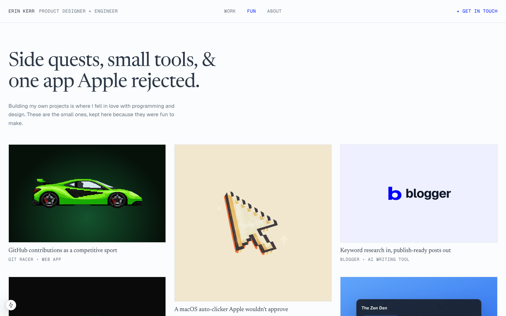

# Redesigning my portfolio for the job I actually want

> DRAFT. Anything in [brackets] is for Erin to fill in or confirm. Screenshots are in `docs/redesign-2026/`.

| | |
|---|---|
| **Role** | Designer and developer, solo |
| **Timeline** | September to October 2026 |
| **Tools** | [Figma?], Next.js, Tailwind CSS |
| **Scope** | Homepage, About, a new side-projects page, and an archive of past editions |

**TL;DR.** I built my 2025 portfolio while I was applying for engineering jobs, and it showed. When I started applying for product design roles, [who: a designer / recruiter / mentor] told me [their words, e.g. "this reads like an engineer's portfolio"]. They were right. I rebuilt the site from a blank page so it says "product designer" first and shows the work, while keeping the engineering that sets me apart.

---

## The problem: my portfolio was pitching me for a different job

I came to design through psychology research and building my own apps, so my first portfolio leaned on what I could ship. That made sense when I was applying for engineering roles. Now I'm going after product design roles, and the site was still making the engineering case.

[One or two sentences on the feedback: who said it, what they said, and what made it land.]

## What the old site was saying

I went through the 2025 site the way a design hiring manager would and wrote down everything that said "engineer" before it said "designer."

**The headline said developer louder than designer.** "Designer &" was set in a thin, light script. "Full Stack Developer" sat under it in a heavy pixel typeface. The line below read "a developer crafting experiences from frontend to backend." The type made the argument before anyone read a word.

**Most of the first screen was widgets, not work.** Ten tiles sat on the first screen, and only one was about my work: a list of three app names. The rest were a photo, my last-played Spotify track, a clock, a GitHub contribution graph, a blog link, a disco-ball mode, a dark-mode toggle and a contact link. They showed I like building fun things. They didn't show design judgment.

**The copy was about code.** Across the homepage and About page, I referred to development, coding or software 13 times and to design twice. The About page opened with "My path into software development wasn't traditional" and listed my hobbies under "When I'm not coding I:".

**The projects page was sorted for engineers.** Its intro promised "my growth as a developer." The first two projects were Git Racer and ASCII Cam, a tool I built in about two hours. My only design case study was fourth out of 13. Every card's metadata was a tech stack (React, TypeScript, Hono), and the Design filter came last.

**The visual language was a developer's.** Pixel display type, monospace body text, and the same saturated blue on every tile. Every tile had the same weight, so nothing on the page stood out as the most important thing.

**The details people check first were wrong.** The location tile still said San Francisco, but I live in New York. The page title and link preview, which is what shows up when I paste my portfolio into an application or a LinkedIn message, said "Software Engineer & Developer Content Creator." Project links sent visitors off to a different site, cybergoose.org.

## Goals

1. **Say "product designer" first** without hiding the engineering.
2. **Put real work on the first screen**, and make it look like design work.
3. **Make every line true.** Each line on the page should trace back to my resume or to work someone can see.

## Process

### First try: a design page added to the old site. I threw it out.

My first pass added a separate `/design` landing page in electric blue, with four case-study cards, a "how I work" section and my tools, linked from the old navigation. [Why you scrapped it. My guess: recruiters land on the homepage, not `/design`, so the front door still said developer. Confirm or replace.]

### Starting over from a blank page, and keeping the old site

Instead of deleting the 2025 site, I froze it. It lives unchanged at `/archive/2025`, with its own copies of every component so future redesigns can't break it. I borrowed the idea from [Lynn Fisher's archive](https://lynnandtonic.com/archive), where every edition of her site stays online. Two reasons: I'm still proud of that site, and it makes this case study honest, because anyone can click through and compare.

### References

[Add 3 to 5 portfolios you looked at, with one line each on what you took from them.]

- **[rachelchen.tech](https://rachelchen.tech):** a mono header, serif headlines, and project tiles that are one brand color with a single real object on them.
- [...]

## Key decisions

### 1. A headline where design is the noun

> I'm Erin, a product *designer* who engineers.

The old headline gave the two jobs equal billing and then made "Developer" louder. The new one names what I am (a product designer) and treats engineering as how I work.

### 2. A switch for the engineers

Under the headline there's a toggle with a pen nib on one side and `</>` on the other. Flipping it moves the italics from "designer" to "engineers" without shifting the words around them. The state is saved in the URL (`?side=engineer`), so I can send a design-engineering team a link that opens on the engineer side. One site serves both audiences, and I don't have to maintain two portfolios.

### 3. Work and Fun as separate pages

Six projects stayed on the Work page. Seven side projects moved to a new Fun page under the headline "Side quests, small tools, & one app Apple rejected." The widgets (Spotify, clock, disco mode) are gone. My personality now lives on Fun and About, where it doesn't compete with the work.

### 4. Titles that say what the thing does

Tiles used to lead with app names. Now each title says what the project does for people, and the small label underneath shows proof instead of a tech stack.

| Before | After |
|---|---|
| Gin Score Tracker | Gin Rummy scores, round by round · App Store |
| Group Sing Along | Lyrics everyone in the room sees in real time · ~155 active users |
| Carpoolio | Group travel app, from first sketch to acquisition · 4.9★ App Store |
| OrderSync Redesign | One design system for a scattered marketing site · Contract 2025 |

### 5. Thumbnails built from the real thing

Each tile is one brand color with one object on it, and wherever I could, that object is real UI rebuilt in code instead of a screenshot. The OrderSync tile shows its actual color tokens and buttons, the order-agent tile is a flow diagram (Email → OrderSync → ERP), and the Group Sing Along tile is a live lyrics card. They load sharp at any size, and they show the design decisions themselves.

### 6. An experience list that says what I did

Next to the headline is a short list from my resume. The last column says what I did at each place instead of my job title (for example, "Ran 500+ research interviews for NIH studies"), because what I did tells a design hiring manager more than a title would.

### 7. An About page rewritten around design

| 2025 | 2026 |
|---|---|
| "My path into software development wasn't traditional." | "My path into design wasn't traditional." |
| "When I'm not coding I:" | "Outside of design and engineering, I'm:" |

The new version connects my research background to how I design: I use the interviewing skills from 500+ research sessions to learn what people need before I design for them.

### 8. Cutting claims I couldn't prove

During the redesign I checked every claim on my OrderSync case study against the actual project. I cut three things:

- **Analytics instrumentation:** I had credited the PostHog setup, but it wasn't my work.
- **"Zero design debt":** My own audit tool reported 22 off-palette colors, so the claim was false.
- **Overstated wording:** "Proves" became "checks."

A portfolio is the one place a hiring manager can't fact-check me in the moment, so it has to hold up.

## Design system

**Color.** Five tokens, each with a light and dark value. In dark mode, paper and ink swap, and the accent blue lightens so it keeps its contrast.

| Token | Light | Dark | Use | Contrast (light / dark) |
|---|---|---|---|---|
| paper | `#FAFCFD` | `#2B3645` | Background | |
| ink | `#2B3645` | `#FAFCFD` | Text | 11.9 / 11.9 |
| muted | `#66727F` | `#A7B1BD` | Labels, metadata | 4.8 / 5.6 |
| line | `#E3E8EE` | `#3D4A5C` | Dividers | |
| blue | `#001AFF` | `#A5B1FF` | Links, active nav, switch | 7.9 / 6.0 |

Every text color passes WCAG AA on its background.

**Type.** Three faces, each with one job:

- **Newsreader** (serif) for headlines and project titles. It brings an editorial voice and replaces the pixel display font.
- **Geist** for body text.
- **Geist Mono** for navigation, labels and metadata. This keeps a little of the old site's engineering flavor, in small doses.

**Components.** `SiteShell`, `SiteHeader`, `Tile` (one brand color with one object; aspect ratio and art style are props) and `HeroHeadline` (the switch).

**Accessibility.**

- The switch is announced as a switch to screen readers (`role="switch"` with a label).
- Every interactive element has a visible focus ring.
- Animations respect reduced-motion settings.
- Every tile has written alt text that describes what's in the picture, not just the project name.

## Before and after

| | 2025 | 2026 |
|---|---|---|
| Headline | "Designer & **Full Stack Developer**" | "I'm Erin, a product *designer* who engineers." |
| First screen | 10 tiles, 1 about work | Headline, experience, then case studies |
| Lead project | Git Racer | OrderSync design system |
| Card metadata | Tech stack | Proof: App Store rating, active users, client |
| Type | Pixel display, mono, script | Serif, sans, mono for labels |
| Side projects | Mixed in with client work | Their own page |
| Old site | Overwritten | Archived at `/archive/2025` |

## What's next

[Launch date.] Once it's live I'll watch [which design roles reply, which case studies get opened, anything else you'll actually track]. [Anything you'd still change: mobile layout, the switch doing more than moving italics, a case study you want to add.]

## What I learned

[2 to 3 lines in your words. Prompts: What surprised you in the audit? What was hard to cut? What would you tell someone redesigning their own portfolio?]
